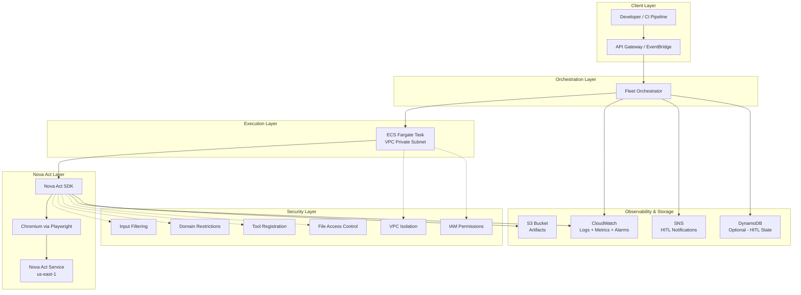
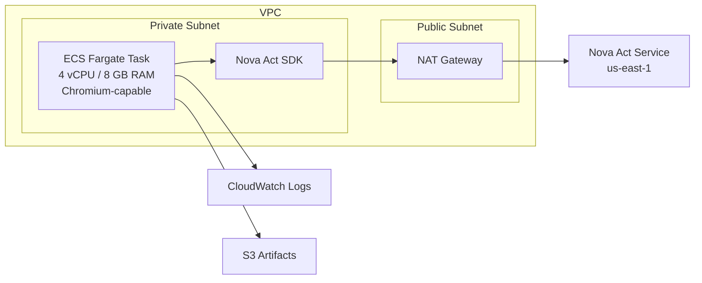
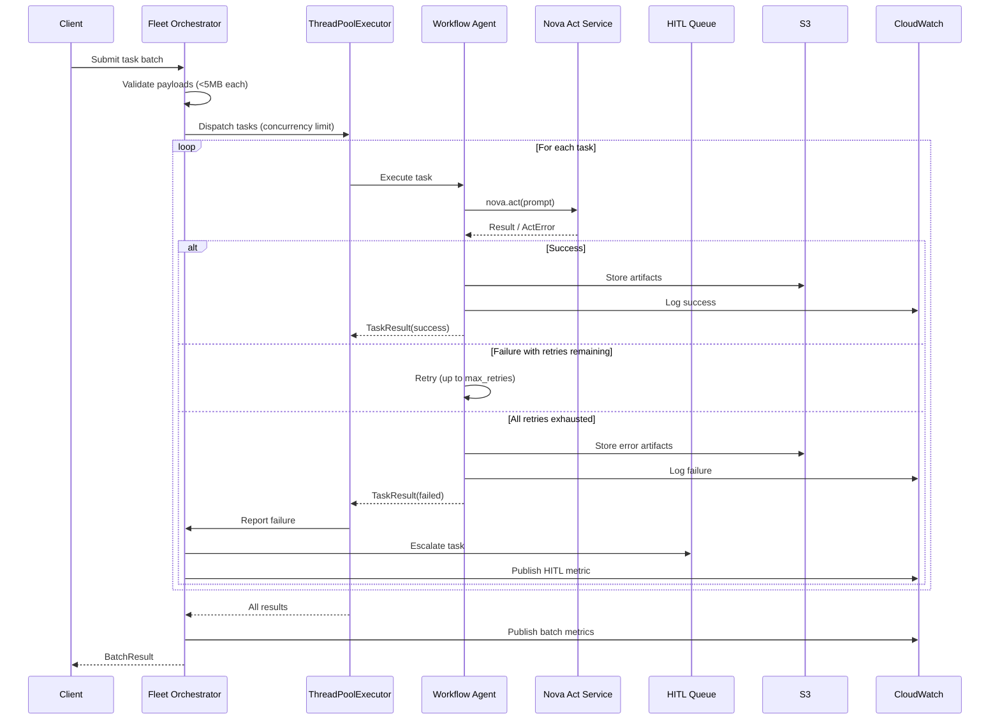
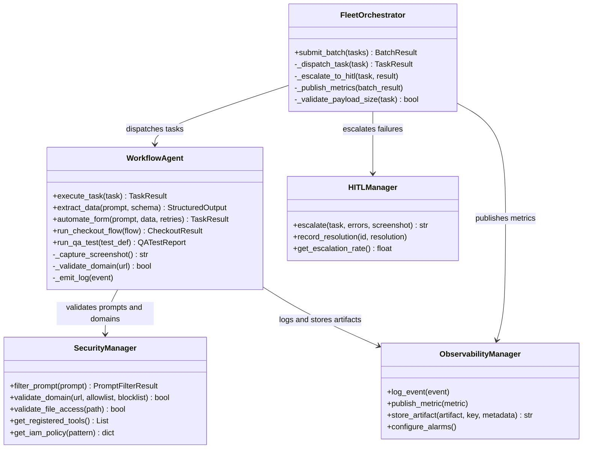

# Architecture

This document describes how the Nova Act Fleet project is structured: the four logical layers, the Amazon ECS Fargate deployment, and how the components hand off to each other on each task.

This project deliberately does **not** target Amazon Bedrock AgentCore Browser. If AgentCore Browser fits your environment, use it instead — see [`why_not_agentcore.md`](why_not_agentcore.md) and the official [Nova Act + AgentCore Browser quickstart](https://docs.aws.amazon.com/bedrock-agentcore/latest/devguide/browser-quickstart-nova-act.html). The architecture below is what you build when AgentCore Browser is off the table. The project also does not ship an AWS Lambda template in v0.2; see [`decision_matrix.md`](decision_matrix.md) § "Why no Lambda template?" for the rationale.

## High-level overview

The system is organized into four layers:

- **Client Layer** — Developer scripts, CI pipelines, or Amazon API Gateway / Amazon EventBridge triggers submit task batches.
- **Orchestration Layer** — `FleetOrchestrator` dispatches tasks to `WorkflowAgent` instances via a thread pool, aggregates results, and escalates retry-exhausted failures.
- **Execution Layer** — `WorkflowAgent` instances run as Amazon ECS tasks on AWS Fargate, each driving a Chromium browser session through the Amazon Nova Act SDK inside your VPC.
- **Supporting Services** — Security (six-layer defense-in-depth), Observability (Amazon CloudWatch Logs and Metrics, Amazon S3), and HITL escalation (Amazon SNS, optional Amazon DynamoDB).

## Deployment: Amazon ECS Fargate

Best for long-running or sustained-throughput Nova Act workloads. Fargate tasks run in a VPC private subnet with the CPU and RAM Chromium needs.

Key characteristics:

- Supports session durations bounded by `AgentConfig.session_timeout_seconds` (max 1800 s / 30 minutes in the framework today).
- 4 vCPU / 8 GB RAM. Chromium runs with the default 64 MB `/dev/shm` allocation that Fargate provides — `LinuxParameters.SharedMemorySize` is **not supported on Fargate** and was removed from the task definition. Single-page browsing sessions (which is what each Nova Act task is) fit comfortably in 64 MB. If a workload is heavy enough to hit the limit, override Chromium's `/dev/shm` use via a custom Playwright instance passed to `NovaAct(playwright_instance=...)`.
- VPC-isolated with NAT Gateway for outbound access.
- Customer-built Amazon ECR image; the template provisions the repository but does not publish a public image.
- IAM execution role (image pull, secret read) and task role (CloudWatch Logs, S3, Secrets Manager, CloudWatch Metrics, optional SNS, optional DynamoDB) are separate, both least-privilege.
- CloudFormation template: [`templates/ecs_deployment.yaml`](../templates/ecs_deployment.yaml).

For the case for AgentCore Browser, see [`decision_matrix.md`](decision_matrix.md).

## Fleet orchestration flow

The `FleetOrchestrator` receives a batch, validates payloads, dispatches tasks to a thread pool of `WorkflowAgent`s, handles retries and HITL escalation, and aggregates results.

Behaviors enforced at each step:

- Payloads exceeding 5 MB serialized JSON are rejected before dispatch.
- Concurrency is bounded by `FleetConfig.concurrency_limit` (default 10).
- Individual task failures do not halt the batch.
- Failed tasks (after `max_retries` exhaustion) are escalated to HITL via SNS.
- Batch metrics (`TaskSuccessRate`, `AverageTaskDuration`, `HITLEscalationRate`) are published to the `NovaActFleet` CloudWatch namespace.

## Component interactions

Wiring rules:

- `FleetOrchestrator` constructs `WorkflowAgent`, `HITLManager`, and `ObservabilityManager` by default; production callers replace the defaults via `set_workflow_agent`, `set_hitl_manager`, and `set_observability_manager`.
- `WorkflowAgent` accepts a `SecurityManager` and `ObservabilityManager` via constructor injection. The security manager runs *before* every Nova Act session is opened — domain validation is the gate, not the cleanup.
- All AWS interactions (CloudWatch, S3, SNS, DynamoDB) go through `boto3` clients that are mockable in tests.

## What this architecture replaces from AgentCore Browser

A team coming from AgentCore Browser will recognize these features. The right column shows where each one lives in this project when AgentCore is unavailable.

| AgentCore Browser feature | Equivalent in this project |
|---|---|
| Managed Chromium session lifecycle | Container-managed Chromium via Playwright on ECS Fargate |
| Session isolation | Fresh `NovaAct` context per task; no shared state across the thread pool |
| Live viewing and replay | Per-step screenshots stored in S3 + Nova Act SDK's local HTML session log |
| CloudTrail of agent actions | CloudTrail covers AWS API calls; the agent's reasoning is captured in CloudWatch Logs only |
| Domain restrictions enforced by the runtime | `SecurityManager.validate_domain` runs in application code before the session opens |
| AgentCore Identity (delegated credentials) | Secrets Manager + customer-managed IAM policies generated by `SecurityManager.get_iam_policy(pattern)` |
| Built-in scaling | `ThreadPoolExecutor` in `FleetOrchestrator` and ECS service autoscaling |
| Built-in HITL | `HITLManager` → SNS topic + optional DynamoDB state |

This table is also reproduced in the README so readers can find the trade-off from either entry point without hunting across files.
